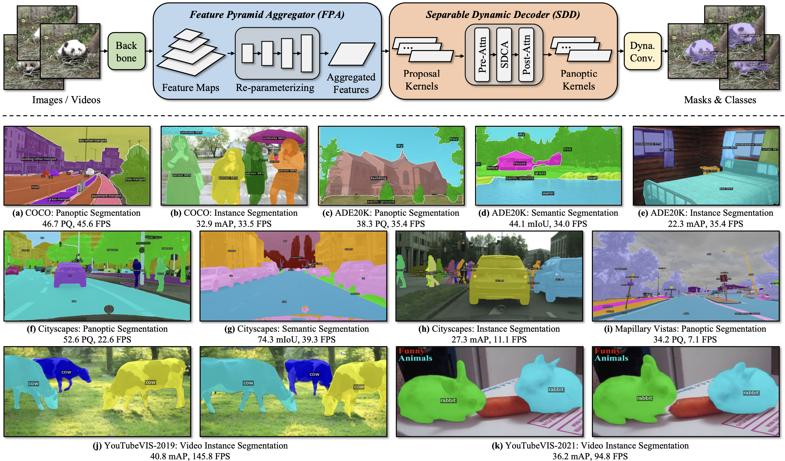

This is the project page for paper: Universal Image Segmentation with Efficiency.



## Key Differences
This paper expands the [YOSO](https://github.com/hujiecpp/YOSO) framework for efficient unified image segmentation, encompassing panoptic, semantic, instance, and video segmentation capabilities. 

The key distinctions are:
- The "UISE/re-parameterize.ipynb" code illustrates the process of reparameterization between IFA and CFA.
- The "UISE/uise_video/" directory demonstrates the integration of UISE into video segmentation workflows.
- The "UISE/config/" directory shows the segmentation tasks that UISE newly supports.

## Model Zoo
Click to download the corresponding model from the [model zoo](https://github.com/hujiecpp/UISE/releases/tag/model).
| Dataset | Pan | Ins | Sem | Video |
|:---:|:---:|:---:|:---:|:---:|
coco | [48.8 PQ](https://github.com/hujiecpp/UISE/releases/download/model/coco_pan_seg_uise.pth)|[32.9 mAP](https://github.com/hujiecpp/UISE/releases/download/model/coco_ins_seg_uise.pth)|[58.7 mIoU](https://github.com/hujiecpp/UISE/releases/download/model/coco_pan_seg_uise.pth)|-
cityscapes | [59.9 PQ](https://github.com/hujiecpp/UISE/releases/download/model/cityscapes_pan_seg_uise.pth) | [32.4 mAP](https://github.com/hujiecpp/UISE/releases/download/model/cityscapes_ins_seg_uise.pth) | [79.3 mIoU](https://github.com/hujiecpp/UISE/releases/download/model/cityscapes_sem_seg_uise.pth) | -
ade20k | [38.3 PQ](https://github.com/hujiecpp/UISE/releases/download/model/ade20k_pan_seg_uise.pth) | [22.3 mAP](https://github.com/hujiecpp/UISE/releases/download/model/ade20k_ins_seg_uise.pth) | [44.1 mIoU](https://github.com/hujiecpp/UISE/releases/download/model/ade20k_sem_seg_uise.pth) | -
mapillary | [34.2 PQ](https://github.com/hujiecpp/UISE/releases/download/model/mapillary_pan_seg_uise.pth) | - | [50.1 mIoU](https://github.com/hujiecpp/UISE/releases/download/model/mapillary_pan_seg_uise.pth) | -
ytb19 | - | - | - | [40.8 mAP](https://github.com/hujiecpp/UISE/releases/download/model/ytb_19_video_ins_seg_uise.pth)
ytb21 | - | - | - | [36.2 mAP](https://github.com/hujiecpp/UISE/releases/download/model/ytb_21_video_ins_seg_uise.pth)

## Getting Started
### Installation
We recommend to use [Anaconda](https://www.anaconda.com/) for installation.

```bash
conda create -n UISE python=3.8 -y
conda activate UISE
conda install pytorch==1.10.1 torchvision==0.11.2 cudatoolkit=11.3 -c pytorch
pip install pycocotools
pip install git+https://github.com/cocodataset/panopticapi.git
pip install fvcore
pip install Pillow==8.4.0
pip install cloudpickle 
pip install timm
pip install scipy
pip install opencv-python
git clone https://github.com/hujiecpp/UISE.git
cd UISE
python setup.py develop
```

### Datasets Preparation
See [Preparing Datasets for Mask2Former](https://github.com/facebookresearch/Mask2Former/tree/main/datasets).

### Training & Evaluation

- Train UISE (e.g., on COCO dataset with R50 backbone).
```bash
python UISE/train_net.py --num-gpus 4 --config-file UISE/configs/coco/panoptic-segmentation/UISE-R50.yaml
```

- Evaluate UISE (e.g., on COCO dataset with R50 backbone).
```bash
python UISE/train_net.py --num-gpus 4 --config-file UISE/configs/coco/panoptic-segmentation/UISE-R50.yaml --eval-only MODEL.WEIGHTS ./model_zoo/coco_pan_seg.pth
```
